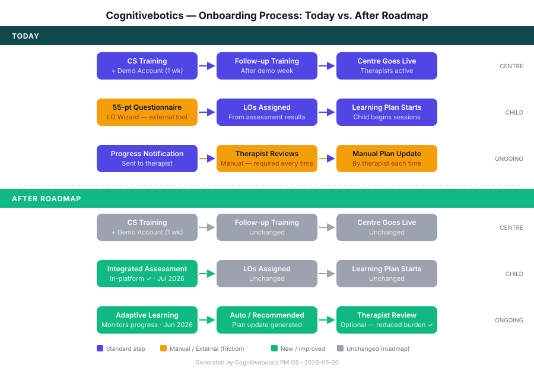

# Cognitivebotics Onboarding: Current Process and What's Coming
**To:** Dr. Venkat Reddy, Advisor (UK)
**Subject:** Follow-up from 19 May — Onboarding Process: Current State and Roadmap
**Purpose:** Share how we onboard centres and children today, and walk through two upcoming product improvements, ahead of deeper collaboration.
**Prepared:** 2026-05-20

---

## Context

Thank you for the time on 19 May. As a follow-up, we wanted to share a clearer picture
of how therapy centres and children are currently onboarded onto the Cognitivebotics
platform — and the two key product improvements we have coming in the near term.

We would welcome your perspective on both the current approach and the direction we are
taking, particularly given your experience with the Indian clinical landscape.

## How Onboarding Works Today

**Centre onboarding** is managed by our Customer Success team in two stages:

1. An initial training session where therapists are introduced to the platform and given a demo account to explore independently for one week.
2. A follow-up training session after the demo week, where questions are addressed and
   the centre is set up for live use.

**Child onboarding** begins with a 55-point questionnaire that helps identify where a
child sits on the spectrum and which skills they currently possess. The responses
determine the first set of Learning Objectives (LOs) — the skill clusters assigned to
the child in their personalised learning plan.

This questionnaire is currently delivered through a separate tool we call the **LO
Wizard**, developed alongside the core platform. The LO Wizard has the following
capabilities:

- Supports multiple languages
- Compares a child's questionnaire responses across different time periods, tracking
  how their profile changes over the course of intervention
- Allows the questionnaire to be shared with a therapist or caregiver to complete at
  their convenience
- Gives therapists independent access to manage assessments for their own children
- Generates reports using the child's live data from the Cognitivebotics platform

## How Progress Is Managed Today

Once a child is onboarded, their progress is monitored on a periodic basis. Therapists
receive notifications when a child is progressing — or when progress is stalling. The
therapist then reviews the performance data and manually adjusts the difficulty or
content of the learning plan.

This process works, but it places a recurring manual review burden on each therapist.
As caseloads grow, this overhead becomes a limiting factor for scale.

## What's Changing: Two Upcoming Improvements

We have two improvements in progress that directly address the friction points above.

**1. LO Wizard integrated into the platform** *(end of July 2026)*

The 55-point questionnaire and LO assignment workflow will be built directly into
Cognitivebotics, replacing the separate LO Wizard tool. Therapists and teachers will
complete the assessment and receive Learning Objective recommendations within a single
workflow — no switching between tools.

**2. Adaptive Learning** *(launching end of June 2026)*

Rather than relying on periodic therapist review, the platform will automatically
respond to a child's progress data in one of two ways:

- The learning plan updates automatically when the data signals it is needed, or
- The system generates a recommended set of changes for the therapist to review and
  approve before they take effect.

This removes the routine overhead of manual progress reviews, allowing therapists to
focus their attention on cases that genuinely require clinical judgement rather than
routine plan maintenance.

The diagram below summarises both the current process and the future state after these
improvements go live.

## Your Feedback

We would be grateful for your thoughts on the above — both the current process and the
direction we are taking. Specifically, it would be valuable to hear:

- Whether the assessment-to-LO-assignment approach aligns with how you see best
  practice for child readiness evaluation in the Indian context
- Any gaps or risks in the current or future process that we should be aware of, from
  your clinical perspective

There is no hard deadline on this — please share your thoughts at your convenience.
